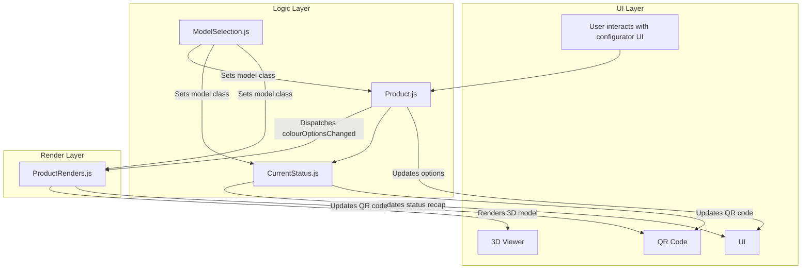

# TM Product Configurator Plugin

## Overview

The TM Product Configurator is a modular WooCommerce/WordPress plugin for visual product setup. It combines option filtering, status updates, and a 3D viewer.

- **Product.js**: Handles option availability, default selection logic, and image/status updates.
- **CurrentStatus.js**: Updates the status recap (price, dimensions, spec, QR code).
- **ModelSelection.js**: Manages selected model classes and related UI state.
- **ProductRenders.js**: Runs the Three.js viewer and keeps render state in sync with selections.

## Structure & Flow

## Flow Summary
1. User changes colours, base, metal, or model.
2. Product.js recalculates valid options, applies defaults, and dispatches `colourOptionsChanged`.
3. CurrentStatus.js updates price/spec/summary details.
4. ProductRenders.js updates model materials and URL/QR state.
5. ModelSelection.js keeps model class state in sync across components.