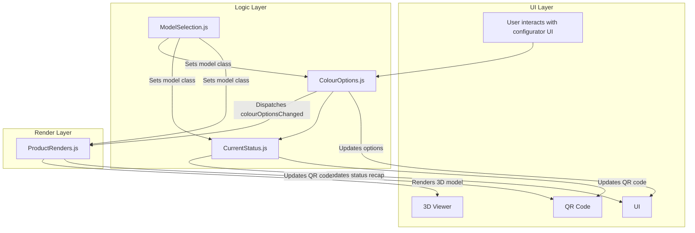

# TM Product Configurator Plugin

## Overview

The TM Product Configurator is a modular JavaScript plugin for WooCommerce/WordPress that enables users to visually configure products (e.g., tables) with real-time 3D previews, dynamic option filtering, and live status recaps. It is composed of several classes, each responsible for a distinct aspect of the configurator:

- **ColourOptions.js**: Manages available colour, base, and metal options, updates UI, and dispatches events when selections change.
- **CurrentStatus.js**: Updates the status recap (price, dimensions, spec, QR code) based on current selections.
- **ModelSelection.js**: Handles model selection, syncing the model class across the UI and logic.
- **ProductRenders.js**: Handles 3D rendering, updates the model based on selections, and manages the QR code for sharing.

## Structure & Flow

## Flow Summary
1. **User interacts with the configurator UI** (selects colours, base, metal, or model).
2. **ColourOptions.js** updates available options, enforces defaults, and dispatches a `colourOptionsChanged` event.
3. **CurrentStatus.js** updates the status recap (price, dimensions, spec, QR code) in real time.
4. **ProductRenders.js** listens for option changes, updates the 3D model, and synchronizes the QR code.
5. **ModelSelection.js** manages the selected model and ensures all modules are in sync.